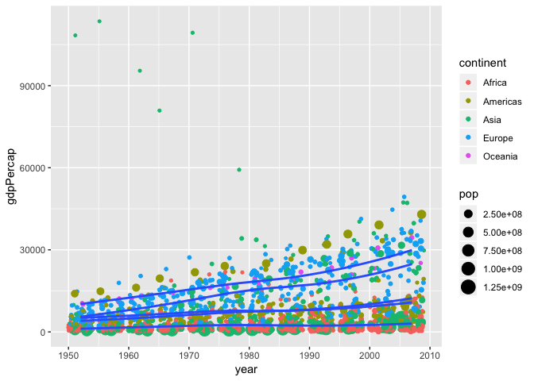

Hw03-Data-Explorer
================

Overview of Tasks for hw03
--------------------------

-   **Bringing in the data**

-   **Minimum and maximum GDP per capita by continent**
    -   Collecting our data
    -   Making a table
    -   Making a plot
    -   Interpreting our data
-   **Distribution of GDP per capita by continent**
    -   Collecting our data
    -   Making a table
    -   Making a plot
    -   Interpreting our data
-   **How life expectancy is changing over time by continent**
    -   Collecting our data
    -   Making a table
    -   Making a plot
    -   Interpreting our data
-   **The interesting story of Kuwait**
    -   Collecting our data
    -   Making a table
    -   Making a plot
    -   Interpreting our data

Tasks
-----

### Bringing in the data

First we have to load our important R packages: gapminder and tidyverse.

``` r
knitr::opts_chunk$set(echo = TRUE)
```

``` r
library(gapminder) #loading gapminder
library(tidyverse) # loading tidyverse
```

    ## ── Attaching packages ─────────────────────────────────────────────────────────────────── tidyverse 1.2.1 ──

    ## ✔ ggplot2 3.0.0     ✔ purrr   0.2.5
    ## ✔ tibble  1.4.2     ✔ dplyr   0.7.6
    ## ✔ tidyr   0.8.1     ✔ stringr 1.3.1
    ## ✔ readr   1.1.1     ✔ forcats 0.3.0

    ## ── Conflicts ────────────────────────────────────────────────────────────────────── tidyverse_conflicts() ──
    ## ✖ dplyr::filter() masks stats::filter()
    ## ✖ dplyr::lag()    masks stats::lag()

### Minimum and maximum GDP per capita by continent

**Collecting our data**

Lets create a new value, minmaxgdp, to represent our data on continental GDP per capita. Gapminder is first grouped by continent to look at the data independently of continent. Then it is further analyzed to find the minimum and maximum values of GDP per capita. These values, for each continent, are stored in the variables, minimum and maximum.

**Making a table of our data**

Using the `knitr::kable()` function, we can visualize our collected data in a neat table

**Making a plot of our data**

Here we use a variety of features within the ggplot plotting package. First, using the continent aesthetic, we create bar plots using maximum and minimum GDP per capita values overlayed ontop of each other. We can assign minimum and maximum values a fill colour to distinguish them.

**Intrepreting our data**

The maximum GDP per capitas are readily observable in this bar chart, where Asia has over double the maximum value compared to all other continents. The minimum values are slighly harder to see because they are so much smaller. Only in Oceania is the minimum GDP per capita very visible. Perhaps it might be beneficial to plot minimum and maximum GDP per capitas independently so they have an appropriate y-axis scale however this overlapped graph offers a good comparison within each continent as well as between continents.

``` r
minmaxgdp <- gapminder %>% #pipe gapminder dataset in
  group_by(continent) %>%  #group data by continent
  summarize(minimum = min(gdpPercap), maximum = max(gdpPercap))#create min/max variable of GDP per cap
  
knitr::kable(minmaxgdp) #visualize table of continental gdp per capita
```

| continent |     minimum|    maximum|
|:----------|-----------:|----------:|
| Africa    |    241.1659|   21951.21|
| Americas  |   1201.6372|   42951.65|
| Asia      |    331.0000|  113523.13|
| Europe    |    973.5332|   49357.19|
| Oceania   |  10039.5956|   34435.37|

``` r
#plot continental gdp per capita using ggplot
ggplot(minmaxgdp, aes(continent)) + #start plotting our contgdp variable using continent as our x-axis
  geom_col(aes(continent,maximum, fill ="maximum"))+ #plot maximum for each continent in red
  geom_col(aes(continent,minimum, fill="minimum"))+ #plot minimum overtop in blue
  ggtitle("Minimum and Maximum GDP Per Capita by Continent") +# add title
  labs(y="GDP Per Capita") + #change y-axis label 
  theme_dark() #add dark theme to visualize light blue better
```


### Distribution of GDP Per capita by continent

**Collecting data**

First we have to collect our data by taking our gapminder dataset and grouping by continent and storing this in `contgdp`.

**Making table of our data**

Use `knitr::kable()` function to print out table of our collected data

**Plotting our data**

Using ggplot, overlay a violin plot on top of a jitter plot to visualize the distribution of GDP per capita for each continent. Add colour to each continent and some transparency in the points of the jitter plot to make it easier to see.

**Intrepreting our data**

Asia has the largest distribution of GDP per capita. However, the bulk of individual values for Asia are extremely low with only a few outliers that are greater than these. America and Europe have similar ranges but Europe has a more even distribution while American is more clustered towards smaller values. Also Oceania has very few values overall.

``` r
contgdp <- gapminder %>% #take gapminder dataset and store in contgdp
  group_by(continent) %>% #group by continent 
  summarize(gdpPercap=mean(gdpPercap))

knitr::kable(contgdp) #print out table of contgdp
```

| continent |  gdpPercap|
|:----------|----------:|
| Africa    |   2193.755|
| Americas  |   7136.110|
| Asia      |   7902.150|
| Europe    |  14469.476|
| Oceania   |  18621.609|

``` r
gapminder %>%
  group_by(continent) %>% 
  ggplot() + #ggplot of contgdp
  geom_jitter(aes(continent, gdpPercap, alpha=0.1, colour=continent)) + #create jitter plot of continent vs gdpPercap where each continent has a colour
  geom_violin(aes(continent, gdpPercap)) + #create violin plot over top of same variables
  theme(legend.position="none") + # remove legend
  ggtitle("Distribution of GDP Per Capita by Continent") # add title
```


### How is life expectancy changing over time

**Collecting the data**

Group data by continent.

**Plotting the data**

Plot line graph of life expectancy over time where each line represents a different continent

**Interpreting the data**

All continents show a steady increase in life expectancy over time. Oceania has consistently had the highest life expectancy while Africa has consistently been the lowest.

``` r
gapminder %>%
  group_by(continent) %>% #group by continent
  ggplot() + 
  geom_smooth(aes(year, lifeExp,colour = continent)) + #line plot of lifeExp over time with continents corresponding to coloured lines
  ggtitle("Life Expectancy Over Time in Different Continents") + #change title
  theme_classic() #change theme
```

    ## `geom_smooth()` using method = 'loess' and formula 'y ~ x'


### Doing More: The interesting story of Kuwait

**Collecting the data**

Lets look at GDP per capita over time for each continent.

**Plotting the data**

Immediately we see several outliers belonging to Asia. To get a better look at these lets filter out all observations for GDP per capitas over 60000 and put these in the variable `outliers`

**Putting the data in a chart**

Lets print out the observations in `outliers`. They all happen to belong to Kuwait. So lets put all observations from the gapminder set in the variable `kuwait` and plot of the GDP per capitas over time.

``` r
#observing gdp per capita over time
gapminder %>%
  group_by(continent) %>% #group by continent
  ggplot() +
  geom_jitter(aes(year,gdpPercap, colour = continent, size=pop)) + #jitter plot of gdppercap over time with continents as different colours and each point being proportional to population
  geom_smooth(aes(year, gdpPercap, line=continent), se= F) #overlay line graph of same variables
```

    ## Warning: Ignoring unknown aesthetics: line

    ## `geom_smooth()` using method = 'loess' and formula 'y ~ x'



``` r
#grouping outliers (gdp per capita above 60000)
outliers <- gapminder %>% filter(gdpPercap > 60000) %>% select(country, year, gdpPercap, pop)

#printing out table of outliers
knitr::kable(outliers)
```

| country |  year|  gdpPercap|     pop|
|:--------|-----:|----------:|-------:|
| Kuwait  |  1952|  108382.35|  160000|
| Kuwait  |  1957|  113523.13|  212846|
| Kuwait  |  1962|   95458.11|  358266|
| Kuwait  |  1967|   80894.88|  575003|
| Kuwait  |  1972|  109347.87|  841934|

**Intrepreting the data**

We can see from a simple line graph of GDP per capita over time for all of our Kuwait observations that there is an interesting distribution. After being the highest in the world in the mid-late 1900's, the GDP per capita rapdily dropped off by the end of the century with a small hint of a revival in the current century. A quick Google [search](https://en.wikipedia.org/wiki/History_of_Kuwait#Modern_era) of Kuwait's economic history around this period revealed that 1946-1982 marks the "golden era" of Kuwait's history. In 1952, Kuwait became the largest oil exporter in the Persian gulf. This lead to massive growth that established the political independence of the country and allowed the diversification of revenue from more industries than just oil.

However, the stock market crashed in 1982 was followed by an economic crisis, decreases in oil price, and several wars including the Gulf war and the war between Iran and Iraq.

``` r
#selecting all observations on Kuwait since all the outliers belong to this country
kuwait <- gapminder %>% filter(country == "Kuwait") %>% select(country, year, gdpPercap, pop)

#simple line plot of Kuwait's gdp per capita over time
ggplot(kuwait) + geom_smooth(aes(year, gdpPercap),se=F) + ggtitle("GDP Per Capita of Kuwait")
```

    ## `geom_smooth()` using method = 'loess' and formula 'y ~ x'


